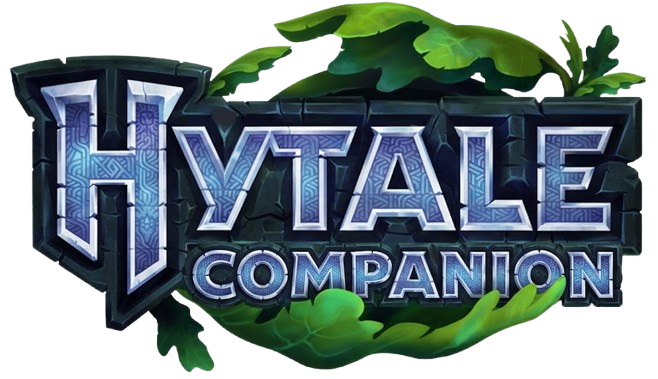
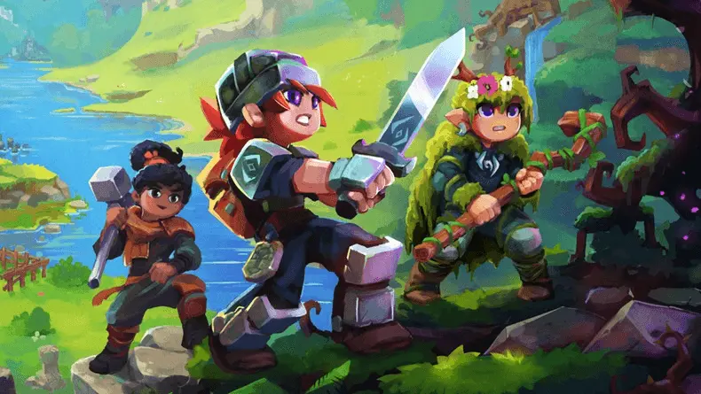
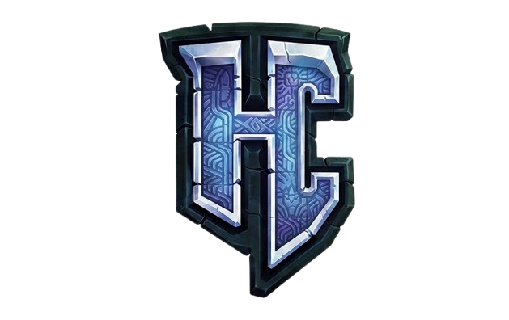

  

  <h1>Hytale Companion</h1>

  

    <strong>The Ultimate Database, Wiki, and Toolset for the World of Orbis.</strong>
  

  

    <a href="https://hytalecompanion.com"><strong>🌐 Visit Official Website</strong></a>
    &nbsp;&nbsp;•&nbsp;&nbsp;
    <a href="#-features">Explore Features</a>
    &nbsp;&nbsp;•&nbsp;&nbsp;
    <a href="#-loot-simulator">Loot Simulator</a>
  

  

    
    
    
  

---

 

## 📖 Table of Contents
1. [About the Project](#-about-the-project)
2. [Key Features](#-key-features)
   - [Crafting Calculator](#-crafting-calculator)
   - [Loot Simulator](#-loot-simulator)
   - [Bestiary & Mobs](#-bestiary--mobs)
3. [Explore the World](#-explore-the-world)
4. [Visit the Companion](#-visit-the-companion)

 

## ⚔️ About the Project

**Hytale Companion** is the most comprehensive community-driven database and utility suite for **Hytale**. Whether you are looking for drop rates, crafting recipes, or detailed creature stats, we provide the data you need to master the world of Orbis.

Our goal is to eliminate guesswork. Stop doing math on a napkin and start planning your builds with precision.

> **[👉 Start exploring the database at HytaleCompanion.com](https://hytalecompanion.com)**

 

## 🌟 Key Features

### 🛠️ Crafting Calculator
Stop wasting resources. Our **Recursive Crafting Calculator** breaks down complex recipes into a simple shopping list of raw materials.
*   **Deep Recursion:** We calculate ingredients down to the base logs and ores.
*   **Workstation Guide:** Know exactly which Tier of workbench you need for every step.
*   **Shareable Lists:** Create a build queue and share the URL with your friends.

### 💎 Loot Simulator
Simulate the grind before you commit. Our **Loot Explorer** mimics the game's actual RNG engine.
*   **Realistic Drop Rates:** See the exact probability of finding that Legendary sword.
*   **Chest Simulation:** Click to "Open Chest" and see a live simulation of what you would get from 100 runs.
*   **Zone Specifics:** Filter loot tables by Zone 1 (Emerald Wilds), Zone 2 (Howling Sands), and more.

### 🦁 Bestiary & Mobs
Survive the wilds with our complete **Bestiary**.
*   **Combat Stats:** View health, damage, and behavior for every mob.
*   **Faction Intelligence:** Learn the difference between Trork, Kweebec, and Scarak warriors.
*   **Drop Tables:** Know exactly what resources to farm from each creature.

 

## 🌍 Explore the World

Prepare for your journey across the diverse biomes of Orbis.

  

 

*   **Zone 1: Emerald Grove** - Lush forests and riverlands.
*   **Zone 2: Howling Sands** - Arid deserts and ancient tombs.
*   **Zone 3: Borea** - Frozen peaks and ice caverns.
*   **Zone 4: Devastated Lands** - Volcanic wastelands and high-tier threats.

 

## 🚀 Visit the Companion

Ready to master Hytale? Access the full suite of tools completely free.

   
  
   
  <h3>
    <a href="https://hytalecompanion.com">Click Here to Launch Hytale Companion</a>
  </h3>

